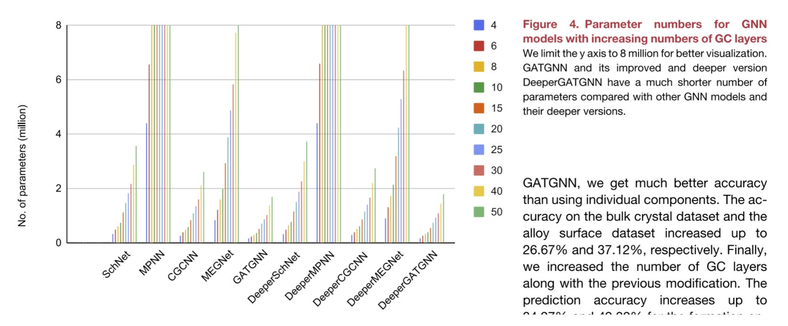

# 0 - SUMMARY

**简要介绍**：

- 该研究开发了Scalable的GNN，用于基于结构的高性能材料属性预测。
- 结合全局注意力机制、可微分组归一化和残差连接来解决过度平滑问题。
- 模型在五个数据集上达到了最先进的性能。
- 相比于现有的GNNs，提出的DeeperGATGNN模型可以扩展到超过30层而不显著降低性能。

**亮点**：

- 开发了具有超过30层的可扩展图神经网络，且不会过拟合。
- 在材料属性预测方面达到了最先进的性能。
- 网络架构设计解决了GNNs的过度平滑问题。
- 对现有GNNs进行了系统性的基准测试研究，用于材料属性预测。

**图形摘要**：

- 图中展示了从输入到输出的流程，包括晶体材料的编码元素组成或节点簇信息。
- 输入部分显示了一个晶体结构的示意图。
- 中间部分展示了深度特征提取过程，使用了多个DeeperGATGNN块。
- 接下来是全局注意力机制和全局池化层。
- 最后是隐藏层和输出层。

**网络架构**：

- 使用了增强的GAT层（Augmented GAT Layer），每个GAT层有K个头（Heads）。
- 包含了可微分组归一化（Diff. Normalization）步骤。

图神经网络（GNNs）已经成为材料属性预测中最具有竞争力的模型，但它们的性能和可扩展性仍然受到过度平滑问题的限制。作者们提出了DeeperGATGNN，结合全局注意力机制、可微分组归一化和残差连接的GNN，以实现不仅在六个数据集中的五个上达到最先进的性能，而且具有很高的可扩展性。我们的技术允许构建非常深的GNNs而不会显著降低性能。

**contribution：**

1. 利用了可微分组归一化（DGN）和跳过连接（skip-connections），使得模型能够在图卷积（GC）层的数量上达到很深的程度，而不会出现性能下降的问题。
2. 不需要复杂的超参数调优。用户只需设置足够的GC层数即可，大大简化了模型的配置过程，并提高了其实用性。
3. 将他们的扩展策略（即DGN和跳过连接）应用到了其他四种GNN模型中，包括CGCNN、MEGNet、MPNN和SchNet，并在多个数据集上取得了显著的性能提升。这些改进后的模型分别被命名为DeeperCGCNN、DeeperMEGNet、DeeperMPNN和DeeperSchNet。（代码中是super而不是deeper）
4. 在六个公开的基准数据集上对DeeperGATGNN进行了评估，结果表明，在五个数据集中，该模型达到了最新的最先进水平（SOTA），平均绝对误差（MAE）减少了多达10%。实验还显示，尽管训练参数数量较少，但DeeperGATGNN是所有现有GNN模型中最具有可扩展性的模型之一，非常适合用于大规模材料属性预测任务。

Scalable：

1. **让GNN网络能够更深（最主要）**：传统的GNN可能会因为层数的增加而遭受过度平滑问题（Over-smoothing），即随着层数增加，节点特征变得越来越相似，导致性能下降。DeeperGATGNN通过引入DGN和跳过连接解决了这个问题，使得模型可以在不显著损失性能的情况下构建非常深的网络。

以下是论文中提到的一些其他的相关特点，但是我感觉不能算是Scalable：

1. **参数效率**：DeeperGATGNN具有很高的深度和复杂度，但相比其他模型使用了较少的训练参数。
2. **灵活性和通用性**：实现方法可以迁移到其他类型的GNN架构中。研究人员将他们的策略应用到了其他四种GNN模型中（但是有的效果不一定好）。
3. **简化超参数调整**：只需要设置足够的GC层数量即可开始训练。
4. **数据集的可扩展：** fig6中的扩大数据集样本，效果越来越好。（但是作者没有继续深入研究了）

# 1 - INTRODUCTION

输入

- 晶体材料：输入是一个编码后的晶体材料，表示为一个节点和边组成的图。
- 编码元素组成或节点簇信息：每个节点代表一个原子，节点的颜色和形状表示不同的原子类型。

深度特征提取

- 增强的GAT层（Augmented GAT Layer）：使用多个（代码中初始是5个，论文中用了5-30个）增强的GAT层进行深度特征提取。每个GAT层包含64个神经元，并应用了可微分组归一化（DGN）。
- 跳过连接（Skip Connection）：从第l个AGAT层的输出到第(l+1)个AGAT层的输出之间添加了一个跳过连接，以保持信息流并减少梯度消失问题。

全局注意力机制

- 全局信息特征化（Global Information Featurization）：将节点特征向量与组成编码向量拼接在一起，形成一个上下文向量。
- 上下文向量（Context Vector）：这个向量包含了与每个节点位置相关的权重。

全局池化

- 全局池化（Global Pooling）：对节点特征向量进行全局池化操作，得到一个紧凑的表示。

隐藏层和输出

- 隐藏层（Hidden Layers）：通过一到两个隐藏层进一步处理节点特征。
- 输出层（Output Layer）：最终通过另一个全连接层产生输出。

表1：六大数据集的详细信息

| Dataset                         | Unit    | Source                         | No. of elements | No. of samples |
| ------------------------------- | ------- | ------------------------------ | --------------- | -------------- |
| Bulk Materials Formation Energy | eV/atom | Materials Project16 | 87              | 36,839         |
| Alloy Surface Adsorption Energy | eV      | CatHub38            | 42              | 37,334         |
| Pt-cluster Total Energy         | eV      | the literature39    | 1               | 19,801         |
| 2D Materials Work Function      | eV      | C2DB40              | 60              | 3,814          |
| MOF Band Gap                    | eV      | QMOF26              | 78              | 18,321         |
| Bulk Materials Band Gap         | eV      | Materials Project16 | 87              | 36,837         |

这些数据集涵盖了多种材料属性预测任务，包括形成能、吸附能、总能量、功函数和带隙等。

**contribution：**

1. 利用了可微分组归一化（DGN）和跳过连接（skip-connections），使得模型能够在图卷积（GC）层的数量上达到很深的程度，而不会出现性能下降的问题。
2. 不需要复杂的超参数调优。只需设置足够的GC层数即可，简化了模型的配置过程。
3. 将他们的扩展策略（即DGN和SC）应用到了其他四种GNN模型中，包括CGCNN、MEGNet、MPNN和SchNet，并在多个数据集上取得了显著的性能提升。这些改进后的模型分别被命名为DeeperCGCNN、DeeperMEGNet、DeeperMPNN和DeeperSchNet。（代码中是super而不是deeper）
4. 在六个公开的基准数据集上对DeeperGATGNN进行了评估，结果表明，在五个数据集中，该模型达到了最新的最先进水平（SOTA），平均绝对误差（MAE）减少了多达10%。实验还显示，尽管训练参数数量较少，但DeeperGATGNN是所有现有GNN模型中最具有可扩展性的模型之一，非常适合用于大规模材料属性预测任务。

# 2 - RESULT

## 2.1 - Architecture description

### **概述**

- **DeeperGATGNN** 是 GATGNN 模型的改进版本，旨在解决传统图神经网络（GNN）中限制模型深度的 **过平滑问题**。
- 该架构基于 **增强图注意力（AGAT）层**，用于提取邻近原子之间的局部依赖特征。
- 模型通过在这些注意力层之间添加 **加性跳跃连接**，并结合 **可微分组归一化（DGN）层**，进一步改进了学习过程。
- 最终架构包括多个 AGAT 层、DGN 操作、跳跃连接、全局注意力层和全局池化层，最后通过几个全连接隐藏层生成预测输出。

### **模型架构细节**

- **局部软注意力（AGAT 层）**：

  $$
   a_{i,j} = \frac{\exp(a_{i,j})}{\sum_{k \in \mathcal{N}_i} \exp(a_{i,k})} 
  $$

  

  具体解释 

  1. **分子部分：** $\exp(a_{i,j})$   - 这是对节点 $ i $ 和节点 $ j $ 之间的原始注意力分数 $ a_{i,j} $ 进行指数化处理。指数化处理的目的是将原始分数转换为正数，并放大差异，使得重要的节点具有更大的权重。 
  2. **分母部分：** $\sum_{k \in \mathcal{N}_i} \exp(a_{i,k})$   - 这是对节点 $ i $ 的所有邻域节点 $ k $ 的指数化注意力分数进行求和。求和的目的是对注意力权重进行归一化，使得所有邻域节点的注意力权重之和为 1。 
  3. **归一化：**   - 通过分子和分母的比值，得到归一化的注意力权重 $ a_{i,j} $。归一化后的注意力权重表示节点 $ j $ 在节点 $ i $ 的邻域中的相对重要性。

- **全局软注意力**：
  $$
  g_i = \frac{(x_i \| E) \cdot W}{\sum_{x_c \in X} (x_c \| E) \cdot W}
  $$

  - $ g_i $: 节点 $ i $ 的全局注意力权重。 

  - $ x_i $: 节点 $ i $ 的学习嵌入向量。

  - $ E $: 晶体的组成向量，表示全局特征。

  - $ x_i \| E $: 节点特征 $ x_i $ 和全局特征 $ E $ 的拼接。

  - $ W $: 参数化矩阵，用于将拼接后的特征映射到一个标量。

  - $ \sum_{x_c \in X} (x_c \| E) \cdot W $: 对所有节点的拼接特征与参数化矩阵的乘积求和，用于归一化。

  

- **skip和 DGN 层**：

  - DeeperGATGNN 在 AGAT 层之间添加了加性跳跃连接，以缓解过平滑问题。
  - 跳跃连接通过将前一层的输出直接添加到当前层的输出中，保持了信息流并减少了梯度消失问题。
  - DGN 层进一步改进了模型的学习能力，通过分组归一化提高了训练的稳定性。

## 2.2 - Dataset Description（不重要）

五个基准数据集，分别用于预测纳米团簇材料（Pt 团簇）、合金表面、块体材料、二维材料和 MOF 材料的形成/表面能。

数据集的详细信息如表 1 所示，总样本数从 3,814 到 37,334，总元素数从 1 到 87，多样性。

| Dataset                         | Unit    | Source                         | No. of elements | No. of samples |
| ------------------------------- | ------- | ------------------------------ | --------------- | -------------- |
| Bulk Materials Formation Energy | eV/atom | Materials Project16 | 87              | 36,839         |
| Alloy Surface Adsorption Energy | eV      | CatHub38            | 42              | 37,334         |
| Pt-cluster Total Energy         | eV      | the literature39    | 1               | 19,801         |
| 2D Materials Work Function      | eV      | C2DB40              | 60              | 3,814          |
| MOF Band Gap                    | eV      | QMOF26              | 78              | 18,321         |
| Bulk Materials Band Gap         | eV      | Materials Project16 | 87              | 36,837         |

# 3 - Model Comparison

**表 2** 展示了 DeeperGATGNN 与其他 SOTA GNN 模型在不同材料属性预测问题上的五折交叉验证性能比较。

**结论**：

- DeeperGATGNN 是有用的，随着 GC 层数的增加，DeeperGATGNN 的性能有提升，不是越深越好，在某些任务和模型上也存在波动。
- 与 GATGNN 相比，DeeperGATGNN 在某些任务上取得了显著的性能提升，例如 Pt 团簇预测任务中提升了 54.03%。
- Deeper结合GATGNN尽管层数变多，但是参数量依旧较少。其他模型的话都是超过500w参数量，DeeperGATGNN只有不到180w

1. **模型评估与比较：** 所有模型在相同的代码框架、数据集和超参数设置下进行训练。之前的基准研究中，不同模型在不同数据集上的表现各异，MEGNet 在所有数据集中表现不佳。

   

2. **DeeperGATGNN 的性能：** DeeperGATGNN 在多个数据集上表现很好，通过增加 GC 层数（10、15、20、25、30），DeeperGATGNN 在某些数据集上进一步提升了性能，每个数据集下的最佳GC层数不一样。

   

3. **超参数调优与训练 epoch：** DeeperGATGNN 在 500 个 epoch 下表现最佳，且在六个数据集中的五个上取得了最佳结果。

   

4. **DGN 和跳跃连接的影响：**

   DGN 和跳跃连接对 GATGNN 和 MEGNet 有性能提升，但对schNet 和 MPNN 效果不佳。增加 GC 层数对一些模型而，没有帮助，有一些会恶化。

   

5. **参数数量与模型复杂度：** DeeperGATGNN 是最节省参数的模型，即使有 50 个 GC 层，参数数量也低于 180 万个。而 MEGNet 和 DeeperMEGNet 的参数数量超过 900 万个

   对于 MPNN 和 DeeperMPNN，当 GC 层数达到 8 时，参数数量超过 800 万个。

   MEGNet 和 DeeperMEGNet，当 GC 层数接近 30 时，它们的参数数量接近 600 万个，导致它们的性能崩溃

   

# 4 - Parameter study

1. **无dropout：**增加dropout率会降低我们模型的性能。所以不需要任何dropout。我们的模型在没有dropout的情况下，使用35层GC取得了更好的结果。
2. **lr：**最佳结果是在0.005
3. **batchsize：**将批量大小从100（模型的默认批量大小）增加到500，间隔为100。从图观察到，100的时候是最好的。
4. **activation Function：**默认情况下，DeeperGATGNN模型使用Softplus激活函数。将Softplus激活函数的结果（MAE：0.1298 eV），ReLU和Leaky-ReLU获得的MAE值分别为0.1514和0.1511 eV。Softplus激活函数在模型中最佳。
5. **graph convolution layers：**即使有50层GC，我们模型的性能也没有太大下降：30层和50层GC的结果非常接近。因此，如果我们的模型可以通过35层GC达到SOTA结果，那么如果我们在这个数据集上继续增加GC层数（>50层GC）并增加更多训练样本，我们可能会取得更好的结果。但由于计算负担，我们没有进一步深入。
6. 五折交叉

# 5 - Scalability comparison

做了浅层模型和深层模型的对比。（是否加SC和DGN）

CGCNN在30层GC时变得不可扩展。论文中早期的GATGNN模型在30层GC时也会恶化。在25到30层GC之间的性能变化也很剧烈，像CGCNN一样。（参数量急剧增加）80w到100w

DeeperCGCNN和DeeperMEGNet的效果不如原始模型

DeeperGATGNN在这个数据集（Bulk Materials Formation Energy）上使用15层GC达到了SOTA结果。是**唯一一个**即使在30层GC时也没有恶化的模型。尽管我们的模型可以扩展到30层或更多GC层，但在15层GC之后性能没有提高（但也没有变差）。

pt数据集上，我们的模型在10层GC之后直到达到35层GC时性能没有提高。

额外工作：还尝试了在我们的模型中使用少量dropout，但并没有改善我们的结果。由于我们的模型性能不会随着GC层数的增加而变差，因此它倾向于对过拟合具有很强的鲁棒性。

# 6 - Ablation study

对 DeeperGATGNN 模型进行了消融实验，以了解每个组件对预测准确率的贡献。

我们选择了 Bulk Crystal Formation Energy和 Alloy Surface Adsorption Energy数据集进行实验。结果如下：

# 7 - Physical insights

做了个t-SNE可视化，说明DeeperGATGNN 好，感觉就是凑图的。

# 8 - Discussion

在设计和训练可扩展的 GNN 模型时发现了一些关键问题：

1. 模型训练不足，有一些论文中只训练了两三百个epoch，但是实际上在500epoch才收敛。
2. 模型平滑问题，使用太多层时性能下降

**GNN 模型容易训练不足**。由于训练复杂度高（一些模型有数百万个参数），当需要进行大规模超参数调整时，就不太行了。

例如，在 GNN 的基准研究中，超参数包括三个编码维度、图卷积（GC）层数、全连接层数、池化方法、学习率和批量大小。

研究发现**现有的 GNN 模型倾向于使用不同的超参数集在不同的数据集上实现最佳性能**。这种昂贵的超参数搜索过程，使作者仅使用 200 个 epoch 进行评估。然而，在图 2 中的分析表明，他们的网络都训练不足，直到 500 个 epoch 才会停止。

这导致他们严重低估了所有报告结果的 GNN 性能。例如，对于合金表面数据集，CGCNN 在 250 个 epoch 的训练中的平均绝对误差（MAE）为 0.06 eV，比 500 个 epoch 训练的结果（0.042 eV）高出 40%。由于在巨大的超参数空间中运行更多 epoch 是**不可行的**，因此更希望使用能够以默认或少量参数调整实现更稳定结果的 GNN 模型。例如，我们的 DeeperGATGNN 模型在五个数据集上实现了 SOTA 结果，使用相同的架构，**只是 GC 层数不同**。

**GNN 通常会遇到过平滑问题**，这会导致在使用太多层时性能下降。这在我们的可扩展性研究和图 7 中有显示。除 DeeperGATGNN 外，所有现有的 GNN 模型在使用 30 层 GC 时性能显著下降。

尽管 DGN 和跳跃连接有效地帮助我们的 DeeperGATGNN 解决了这个问题，但对 SchNet、CGCNN 和 MEGNet 来说，同样的策略并没有同样好地发挥作用，虽然确实帮助提高了它们的性能。

**另一个限制模型性能的因素是数据的稀缺性或输入到模型中的信息**。例如，在只有 3,814 个样本的 2D 材料数据集中，MEGNet 在 4 层 GC 时取得了最佳结果。我们的 DeeperGATGNN 在这个数据集上使用 25 层 GC 实现了 SOTA 结果。在这种情况下，为了进一步提高性能，似乎需要额外的信息，例如材料结构的角度信息。其他方法，如预激活跳跃连接或 DenseNet 作为跳跃连接方法，也可以应用。

# DGN

DGN 通过以下步骤有效解决了过平滑问题：

1. **聚类分配**：使用聚类分配矩阵 $S^{(l)}$ 将图的节点分配到不同的聚类中。
2. **分组归一化**：对每个聚类分别进行归一化，使同一聚类中的节点表示相似，不同聚类中的节点表示分离。
3. **最终嵌入**：通过结合原始嵌入和归一化后的嵌入，生成最终的嵌入矩阵。

训练深度 GNN 架构的一个主要问题是过平滑问题，即随着 GC 层数量的增加，图中所有节点的表示向量变得无法区分。这个问题限制了 GNN 的层数，以实现更好的性能。例如，GAT 和 GCN 在层数仅限于两层时表现最佳，因此无法利用高阶邻居的特征。

已经采用了许多方法来改进这个问题。传统的归一化技术用于减少这个问题，包括批量归一化或基于节点对距离的措施，如对归一化。但这些技术没有考虑全局图结构，当 GNN 的 GC 层数较大时，会导致次优性能。

最近，Zhou 等人通过提出 DGN 解决了这个问题。DGN 的主要过程是首先使用聚类分配矩阵将图的节点聚类到不同的聚类中，然后分别对每个聚类进行归一化。这将使同一社区/类中的节点表示相似，而不同类中的节点表示分离，从而有效控制过平滑问题。

DGN 在防止过平滑问题方面如此成功的主要原因有两个：

1. 每个组分别使用公式 5 进行归一化，因此每个组将具有不同的均值和标准差；
2. 通过这种方式，DGN 能够更好地保留图的全局结构信息，从而提高模型的性能。

**公式 3**
$$
S^{(l)} = \text{softmax}(H^{(l)}U^{(l)})
$$

- $S^{(l)}$：第$l$层的聚类分配矩阵，表示每个节点被分配到每个聚类的概率。
- $H^{(l)}$：第$l$层的嵌入矩阵，表示节点的特征表示。
- $U^{(l)}$：可训练参数矩阵，用于将嵌入矩阵映射到聚类空间。
- $\text{softmax}$：softmax函数，用于将每个节点的聚类概率归一化。

**公式 4**
$$
H_i^{(l)} = S^{(l)}[:, i] \circ H^{(l)}
$$

- $H_i^{(l)}$：第$l$层第$i$个聚类的嵌入矩阵。
- $S^{(l)}[:, i]$：第$l$层聚类分配矩阵的第$i$列，表示每个节点被分配到第$i$个聚类的概率。
- $H^{(l)}$：第$l$层的嵌入矩阵。
- $\circ$：逐行乘法运算符，用于将每个节点的嵌入向量与其被分配到第$i$个聚类的概率相乘。

**公式 5**
$$
\tilde{H}_i^{(l)} = \gamma_i \left(\frac{H_i^{(l)} - \mu_i}{\sigma_i}\right) + \beta_i
$$

- $\tilde{H}_i^{(l)}$：第$l$层第$i$个聚类的归一化嵌入矩阵。
- $H_i^{(l)}$：第$l$层第$i$个聚类的嵌入矩阵。
- $\mu_i$：第$i$个聚类的均值。
- $\sigma_i$：第$i$个聚类的标准差。
- $\gamma_i$ 和 $\beta_i$：可训练参数，用于缩放和偏移归一化后的嵌入矩阵。

**公式 6**
$$
\tilde{H}^{(l)} = H^{(l)} + \lambda \sum_{i=1}^G \tilde{H}_i^{(l)} \in \mathbb{R}^{n \times d^{(l)}}
$$

- $\tilde{H}^{(l)}$：第$l$层的最终嵌入矩阵。
- $H^{(l)}$：第$l$层的嵌入矩阵。
- $\lambda$：平衡因子，用于控制归一化嵌入矩阵的影响。
- $G$：聚类的数量。
- $\tilde{H}_i^{(l)}$：第$l$层第$i$个聚类的归一化嵌入矩阵。
- $\mathbb{R}^{n \times d^{(l)}}$：表示最终嵌入矩阵的维度，其中$n$是节点数量，$d^{(l)}$是第$l$层的嵌入维度。

# Skip connections for enabling scalable GNNs

在深度学习中，训练非常深的网络的一个主要技术是残差跳跃连接，这最初在ResNet框架中引入。

它允许训练超过1,200层的网络。残差跳跃连接的关键思想是学习实现恒等映射，其中输入$x$被加到堆叠层的输出$F(x)$上。因此，我们有$H(x) = F(x) + x$。与其学习底层映射函数$H(x)$，堆叠层用于学习残差映射$F(x) = H(x) - x$。

主要好处是，如果恒等映射已经是最优的，并且堆叠层无法学习更多显著的信息，训练过程可以将残差映射推向零，以避免退化问题。残差连接已被引入GNNs以训练更深的网络。在这项工作中，我们在GNN模型的deeper版本中实现了逐层残差跳跃连接，这与IRNet类似。ResNet和我们实现的跳跃连接方法之间的区别如图S3所示。

**ResNet**：跳跃连接跨越两层权重层，将输入直接加到两层权重层的输出上，用于解决梯度消失和退化问题。

**DeeperGATGNN**：跳跃连接在每一层之间进行，将前一层的输出直接传递到当前层，用于解决图数据中的过平滑问题，并提高模型的表示能力。

ResNet 

1. **输入 \( x \)**: 输入特征。
2. **权重层 (Weight Layer)**: 包含可训练参数的层，用于对输入特征进行变换。
3. **ReLU 激活函数**: 对权重层的输出进行非线性变换。
4. **残差映射 \( F(x) \)**: 权重层的输出。
5. **恒等映射 (Identity)**: 直接将输入 \( x \) 传递到输出。
6. **输出 \( F(x) + x \)**: 残差映射 \( F(x) \) 与恒等映射 \( x \) 相加，得到最终输出。
7. **ReLU 激活函数**: 对最终输出进行非线性变换。

在 ResNet 中，跳跃连接跨越了两层权重层，将输入 \( x \) 直接加到两层权重层的输出 \( F(x) \) 上，避免了梯度消失和退化问题。

DeeperGATGNN 

**图卷积层 (Graph Convolution Layer)**: 用于处理图数据的卷积层，能够捕获节点之间的关系。

**跳跃连接 (Skip-Connection)**: 将前一层的输出直接传递到当前层，保持信息流并减少梯度消失问题。

在 DeeperGATGNN 中，跳跃连接是在每一层之间进行的，而不是像 ResNet 那样跨越多层。能够更有效地利用深层网络的表示能力，同时避免过平滑问题。通过在每一层之间添加跳跃连接，模型能够更好地捕获图数据的复杂结构。

# Evaluation criterion

为了评估模型的性能，我们使用平均绝对误差（MAE），这是材料属性预测问题的标准评估标准，也是Fung等人基准研究中的主要评估标准。根据具体实验，我们使用5折交叉验证和留出测试进行性能评估。基线模型的参数在Fung等人的补充信息中指定。我们的DeeperGATGNN模型的超参数也在注释S2中提供。

#  For Code

**1. 模型架构**

**GATGNN**：原始的 `GATGNN` 模型是一个标准的图注意力网络，包含预处理层、图卷积层、全局注意力层和后处理层。模型的深度相对较浅，通常只有几层图卷积层。

**DEEP_GATGNN**：`DEEP_GATGNN` 模型在 `GATGNN` 的基础上增加了模型的深度，支持更多的图卷积层（`gc_count` 参数）。模型通过添加跳跃连接（skip connections）和残差连接（residual connections）来缓解过平滑问题，提高模型的表达能力。

**2. 跳跃连接和残差连接**

**DEEP_GATGNN**：在图卷积层之间添加了跳跃连接，将前一层的输出直接添加到当前层的输出中，保持信息流并减少梯度消失问题。通过残差连接，更有效地训练 deeper 的网络结构。

**3. 批标准化**

**GATGNN**：使用标准的 `BatchNorm1d` 进行批标准化。

**DEEP_GATGNN**：使用 `DiffGroupNorm` 进行批标准化，差分分组批标准化方法，能够更好地处理图数据中的节点特征。

**5. 池化方式**

**GATGNN**：支持多种池化方式（如 `global_add_pool`、`set2set` 等），但池化顺序固定为 "early"。

**DEEP_GATGNN**：支持更灵活的池化顺序（`pool_order` 参数），可以选择 "early" 或 "late"。在 "late" 池化顺序下，模型在后处理层之后进行池化，这有助于更好地利用图的全局信息。

**6. 输出层**

**GATGNN**：输出层的维度由 `output_dim` 决定，通常是一个全连接层。

**DEEP_GATGNN**：输出层的维度由 `output_dim` 决定，但在 "late" 池化顺序下，模型会使用额外的全连接层（`lin_out_2`）来处理池化后的特征。

主要体现：

1. **模型深度**：支持更多的图卷积层，能够处理更复杂的图结构。
2. **跳跃连接和残差连接**：通过跳跃连接和残差连接，缓解过平滑问题，提高模型的表达能力。
3. **批标准化**：使用差分分组批标准化，更好地处理节点特征。
4. **池化方式**：支持更灵活的池化顺序，能够更好地利用图的全局信息。
